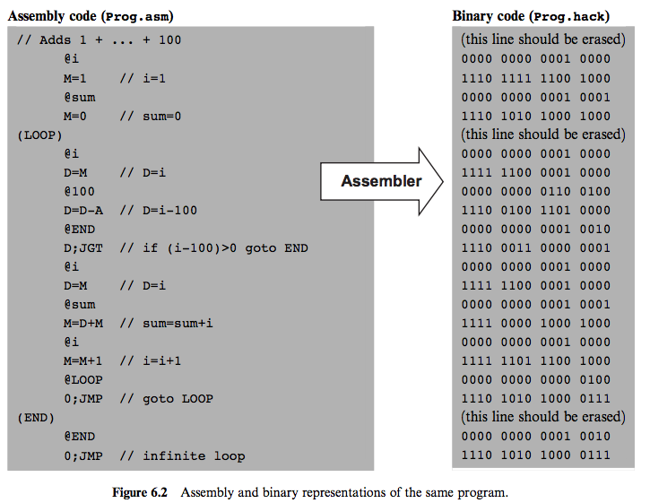

# HackAssembler
An assembler for the hack language written in java     
The program takes as an input an assembly file and outputs a hack file     

 

* **Symbols**
    * *Label symbols* (In the program above *LOOP* and *END* are label symbols) are used to mark the memory location of the next instruction in the program. Label symbols are used for *control flow* in the program.
    * *Variable symbols* (In the program above *i* and *sum* are variable symbols) are treated as *variable*. Variables are mapped to consecutive memory locations.
    
* **Symbols table**: Since Hack instructions can contain symbols, the symbols must be resolved into actual addresses.

    | Symbol     | Memory location |
    | :-------   | :----------:    |
    | i          | 16              |
    | sum        | 17              |
    | LOOP       | 4               |
    | END        | 18              |

    The table above is the symbol table for the program above. Since in Hack system we allocate memory for variable from memory 16 so the memory location for variable *i* will be 16 and *sum* will be 17. To specify label *LOOP* and *END* we count the number of instructions in the program so that *LOOP* will be4 and *END* will be 18. 
